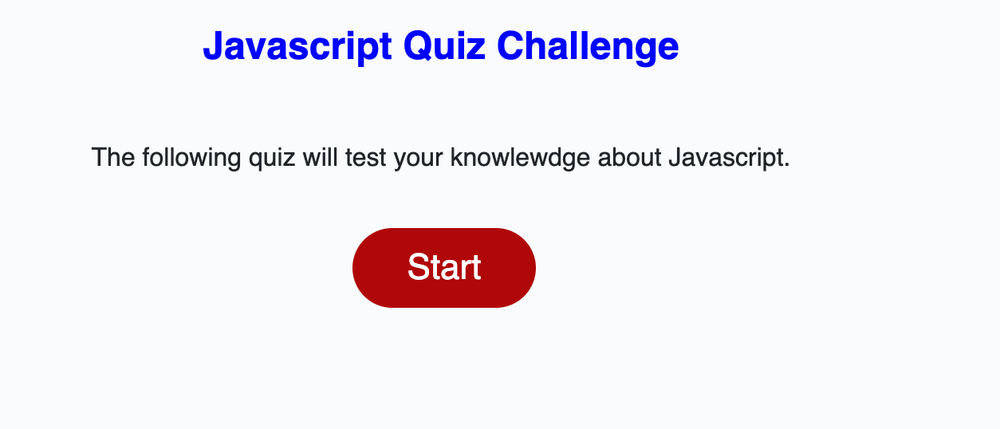
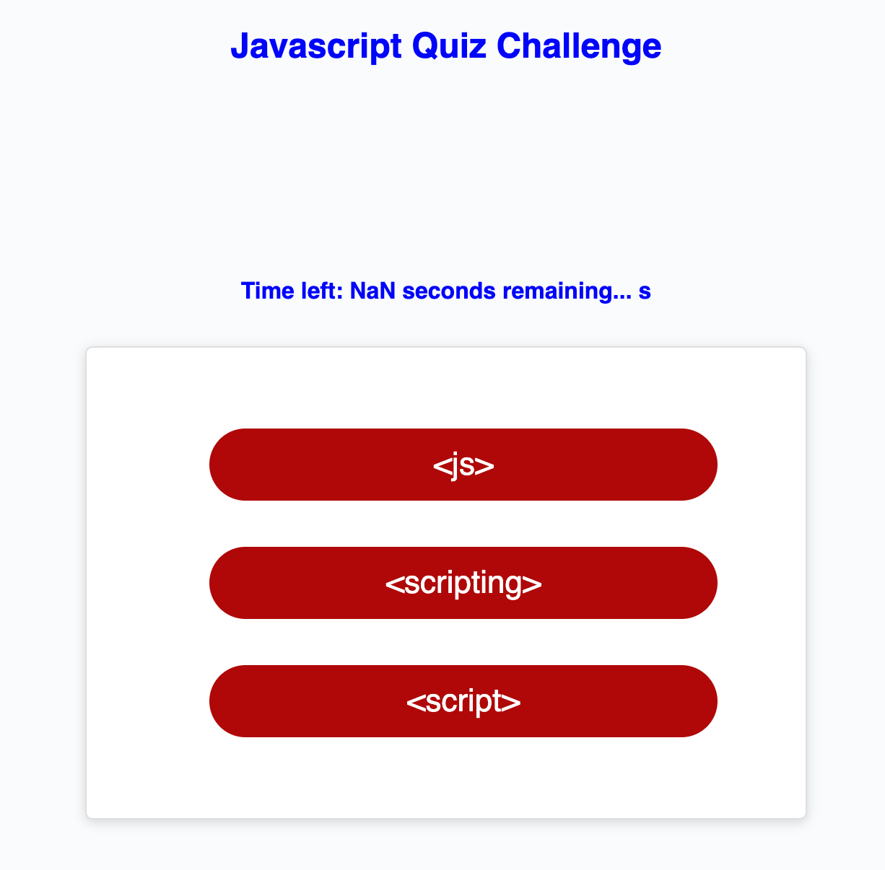

# codequiz
This app is a timed code quiz with multiple-choice questions.
The initial timing interval is set for 3s for each question. 
At the quiz is launched, the questions are display. When a question is selected,
an answer is displayed. The timer decrements by 3 s and the correct answer is displayed. When the quiz is over, the score is shown. The score is on 100, and based on the number of questions.

The link to the repository: 
The link to the deployed version: 

view of initial launching screen: 
view of the screen at click of launch process 

view of first question elements and decrementing timer: 

